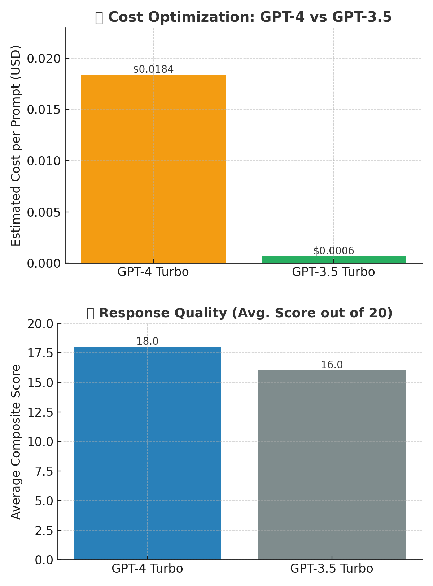

# 🧠 OpenAI Batch Prompt Runner

A lightweight CLI tool for running batches of prompts through OpenAI's GPT models using Python. This repo contains three versions of a script that:
- Reads prompts from a file (`prompts.txt`)
- Sends them one by one to the OpenAI API
- Logs each response
- Estimates token usage and cost
- Optionally saves results to `.txt` and `.csv` files

---

## 📂 Script Versions

### `batch_from_file.py` (v1)
- **Model**: GPT-3.5 Turbo
- **Token Limit**: 150
- **Output**: Individual `.txt` files
- **No CSV logging**
- **Simplest version** – great for quick testing.

---

### `batch_from_file_v2.py` (v2)
- **Model**: GPT-4 Turbo
- **Token Limit**: 600
- **Output**:
  - `.txt` file per prompt with usage summary
  - Central CSV log (`summary_log.csv`) with tokens, cost, truncation info
- **Added rate limit protection**

---

### `batch_from_file_v3.py` (v3)
- **Model**: GPT-3.5 Turbo
- **Token Limit**: 1000
- **Output**:
  - `.txt` per response
  - CSV log (`summary_log_v3.csv`)
- **Includes cost calculation per prompt**
- **Detects and logs truncation**
- **Clean terminal summaries**

---

## 📜 `prompts.txt` Format

Create a file named `prompts.txt` with **one prompt per line**. For example:

```
prompt1
prompt2
prompt3
prompt4
...
...
...
promptx
```

Avoid blank lines at the end.

---

## 🔐 Setup: `.env` File

Before running, create a `.env` file in the project folder:

```
OPENAI_API_KEY=sk-xxxxxxxxxxxxxxxxxxxxxxxxxxxxxxxxxxxxxxxx
```

Make sure to:
- Use your own OpenAI key
- Never commit `.env` to public repos

---

## ▶️ How to Run

1. **Install dependencies:**
   ```bash
   pip install openai python-dotenv
   ```

2. **Prepare files:**
   - `.env` with your key
   - `prompts.txt` with your prompts

3. **Run a script:**
   ```bash
   python batch_from_file.py        # basic
   python batch_from_file_v2.py     # with CSV and GPT-4
   python batch_from_file_v3.py     # GPT-3.5, 1000-token limit
   ```

4. **Check outputs:**
   - Text files: `response_1.txt`, `response_2.txt`, ...
   - CSV logs: `summary_log.csv` or `summary_log_v3.csv`

---

## 🧾 Output Breakdown

Each script (except v1) tracks:
- Prompt and response tokens
- Truncation status
- Cost per prompt and total cost
- First 250 characters of response in CSV
- Full response saved in `.txt` files with usage details

---

## 🤖 Model Comparison Summary
<p align="center">
  
</p>

This chart summarizes the tradeoff between **cost per prompt** and **average response quality**:

| Model         | Avg. Cost per Prompt | Avg. Quality Score (out of 20) |
|---------------|----------------------|--------------------------------|
| GPT-4 Turbo   | $0.0184              | 18.0                           |
| GPT-3.5 Turbo | $0.0006              | 16.0                           |

- **GPT-3.5 Turbo** is cost-efficient and fast.
- **GPT-4 Turbo** is more powerful and accurate but more expensive.

---

## 🛠️ Tip for Beginners

Clone the repo and use `batch_from_file.py` first to get started.
Then explore `v2` and `v3` for more advanced logging and flexibility.

---

## 📌 License & Usage

This project is intended for educational or research use. API usage costs are your responsibility.
